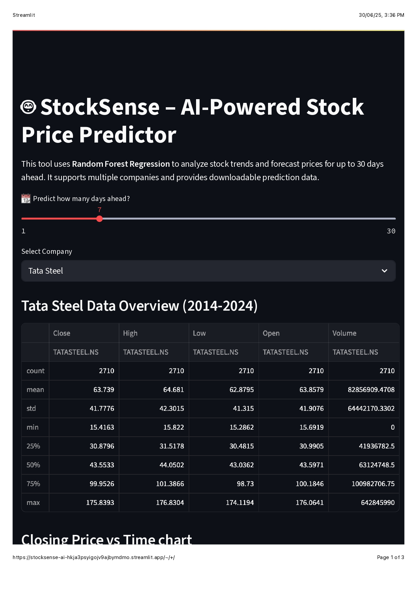
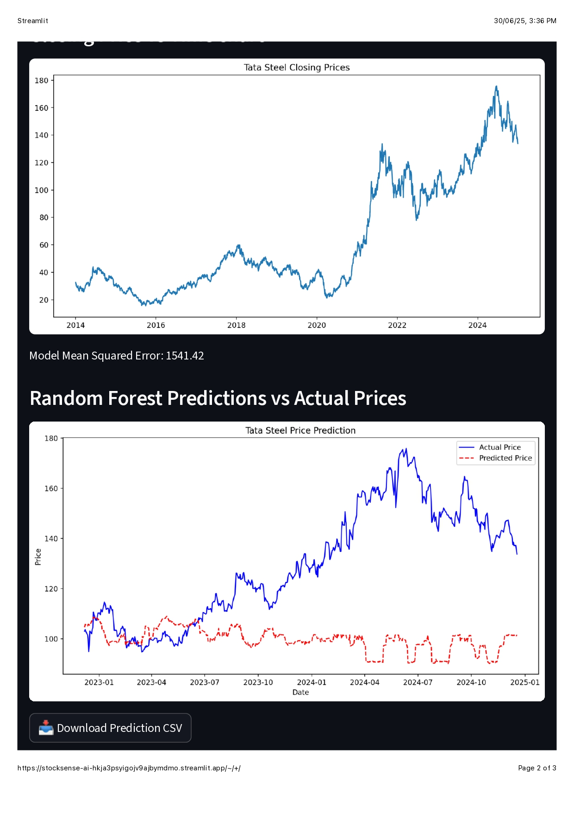
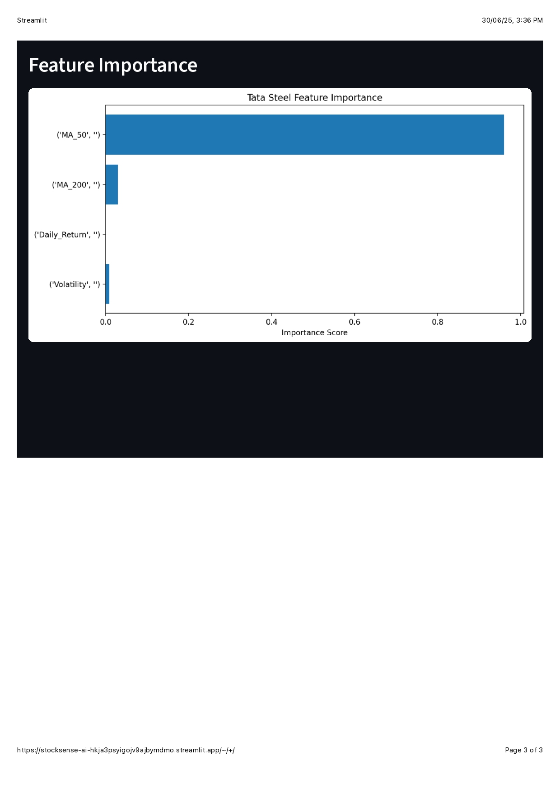

# 🤖 TickerBeat AI – The Rythm of Trend

**TickerBeat AI** is a web-based stock prediction tool that uses machine learning to forecast stock prices for major companies like Vedanta, Tata Steel, and TCS. Built using Streamlit and Random Forest Regression, it provides interactive visualizations, CSV download options, and prediction sliders.

---

## 🚀 Live Demo

[](https://tickerbeat-ai-ehsh2dawaeymf9mdkdmfnw.streamlit.app)

---

## 🧠 Features

- 📈 Real-time stock data via Yahoo Finance
- 🤖 Random Forest-based machine learning model
- 🧮 Indicators: Moving averages, volatility, daily returns
- 📆 Predict prices for next day, week, or month (1–30 days ahead)
- 📊 Graph of actual vs predicted prices
- 📥 CSV download of predictions
- 💻 Simple, clean UI with Streamlit

---

## 🖼️ App Screenshots

### 🔹 Home & Company Selection


---

### 🔹 Stock Chart Visualization


---

### 🔹 Prediction Results (ML Model)


---

## ⚙️ Tech Stack

| Tool            | Purpose                       |
|-----------------|-------------------------------|
| `Streamlit`     | Web UI                        |
| `scikit-learn`  | ML Model (Random Forest)      |
| `yfinance`      | Real-time stock data          |
| `pandas`        | Data processing               |
| `matplotlib`    | Data visualization            |
| `GitHub`        | Code hosting & versioning     |

---

## 🧪 Local Installation

```bash
git clone https://github.com/your-username/tickerbeat-ai.git
cd tickerbeat-ai    
pip install -r requirements.txt
streamlit run apple.py
