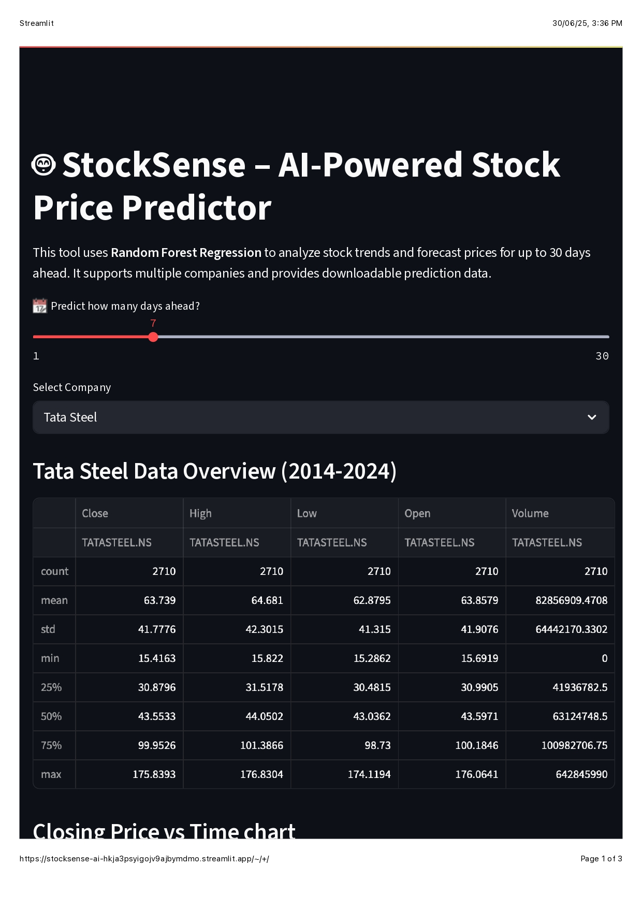
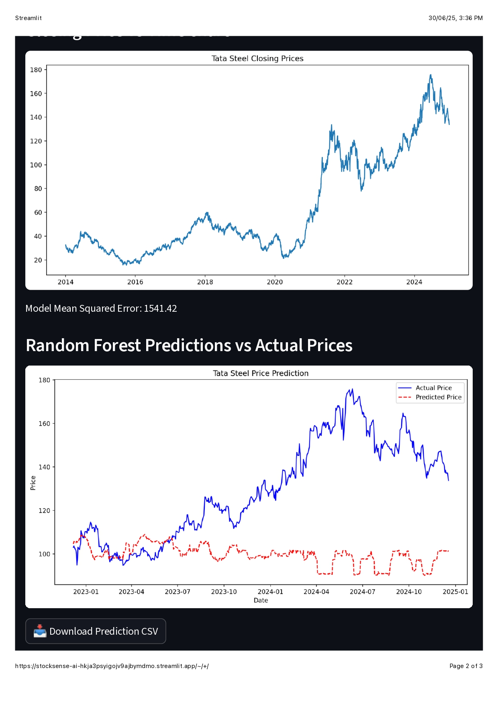

# 🤖 StockSense AI – Smart Stock Price Predictor

**StockSense AI** is a web-based stock prediction tool that uses machine learning to forecast stock prices for major companies like Vedanta, Tata Steel, and Apple. Built using Streamlit and Random Forest Regression, it provides interactive visualizations, CSV download options, and prediction sliders.

---

## 🚀 Live Demo

[](https://stocksense-ai-hkja3psyigojv9ajbymdmo.streamlit.app)

---

## 🧠 Features

- 📈 Real-time stock data via Yahoo Finance
- 🤖 Random Forest-based machine learning model
- 🧮 Indicators: Moving averages, volatility, daily returns
- 📆 Predict prices for next day, week, or month (1–30 days ahead)
- 📊 Graph of actual vs predicted prices
- 📥 CSV download of predictions
- 💻 Simple, clean UI with Streamlit

---

## 🖼️ App Screenshots

### 🔹 Home & Input Panel


---

### 🔹 Chart Visualization (Tata Steel Example)


---

### 🔹 Prediction Results with MSE


---

## ⚙️ Tech Stack

| Tool            | Purpose                       |
|-----------------|-------------------------------|
| `Streamlit`     | Web UI                        |
| `scikit-learn`  | ML Model (Random Forest)      |
| `yfinance`      | Real-time stock data          |
| `pandas`        | Data processing               |
| `matplotlib`    | Data visualization            |
| `GitHub`        | Code hosting & versioning     |

---

## 🧪 Local Installation

```bash
git clone https://github.com/your-username/stocksense-ai.git
cd stocksense-ai    
pip install -r requirements.txt
streamlit run apple.py
