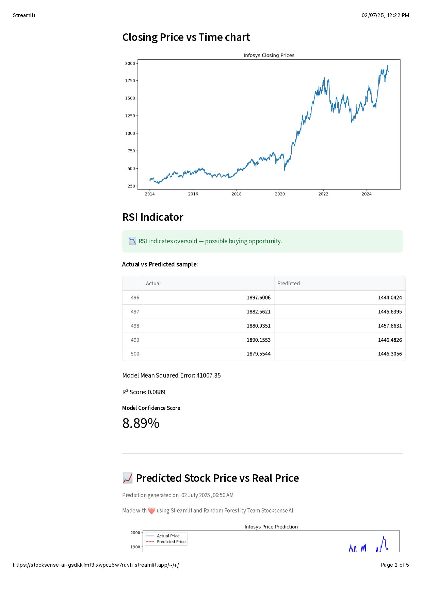

# 🤖 StockSense AI – AI-Based Stock Price Predictor

**Stocksense AI** is a web-based stock prediction tool that uses machine learning to forecast stock prices for major companies like Vedanta, Tata Steel, and TCS. Built using Streamlit and Random Forest Regression, it provides interactive visualizations, CSV download options, and prediction sliders.

---

## 🚀 Live Demo

[](https://tickerbeat-ai-ehsh2dawaeymf9mdkdmfnw.streamlit.app)

---

## 🧠 Features

- 📈 Real-time stock data via Yahoo Finance
- 🤖 Random Forest-based machine learning model
- 🧮 Indicators: Moving averages, volatility, daily returns
- 📆 Predict prices for next day, week, or month (1–30 days ahead)
- 📊 Graph of actual vs predicted prices
- 📥 CSV download of predictions
- 💻 Simple, clean UI with Streamlit

---

## 🔍 How It Works

1. Fetches historical stock data using `yfinance`
2. Calculates technical indicators like MA, RSI, volatility
3. Trains a Random Forest model on past data
4. Predicts closing prices for future days (1–30)
5. Displays insights, trends & allows CSV export

---

## 🖼️ App Screenshots

### 🔹 1.


---

### 🔹 2.


---

### 🔹 3.


---

### 🔹 4.


---

## ⚙️ Tech Stack

| Tool            | Purpose                       |
|-----------------|-------------------------------|
| `Streamlit`     | Web UI                        |
| `scikit-learn`  | ML Model (Random Forest)      |
| `yfinance`      | Real-time stock data          |
| `pandas`        | Data processing               |
| `matplotlib`    | Data visualization            |
| `GitHub`        | Code hosting & versioning     |

---

## 🧪 Local Installation

```bash
git clone https://github.com/Manavgupta12/tickerbeat-ai.git
cd tickerbeat-ai    
pip install -r requirements.txt
streamlit run apple.py

```
📝 License

This project is open-source and free to use under the MIT License.

---

🌟 Show Some ❤️

If you like the project, drop a ⭐ on GitHub and share with your peers!
